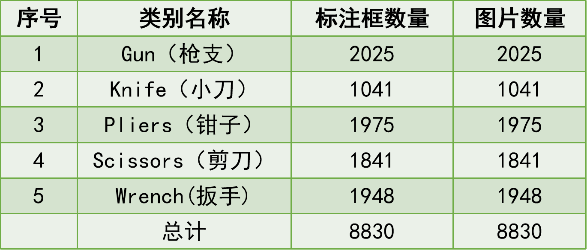
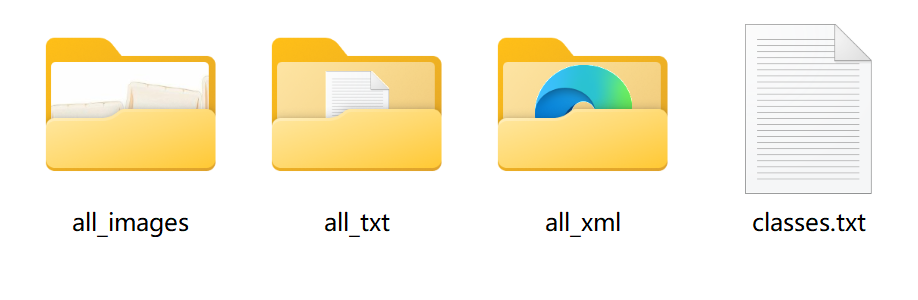
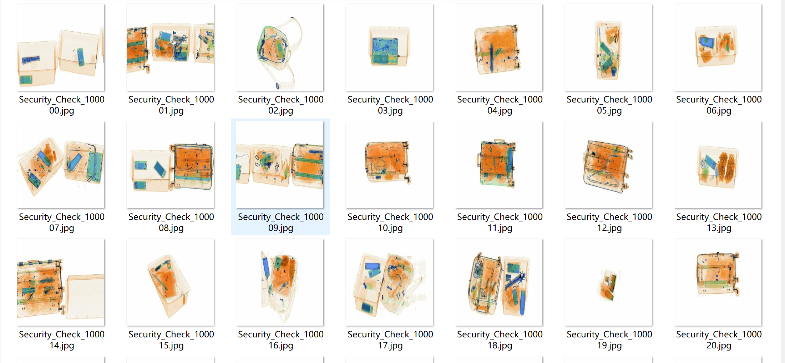
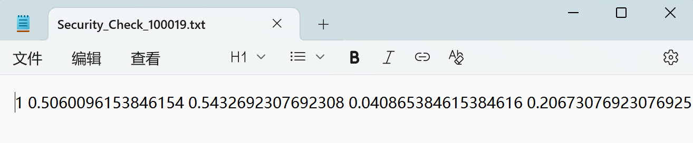
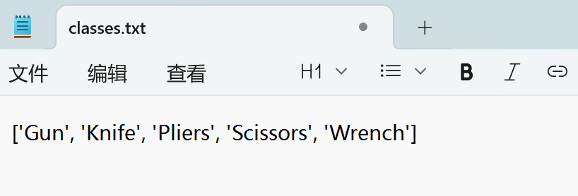
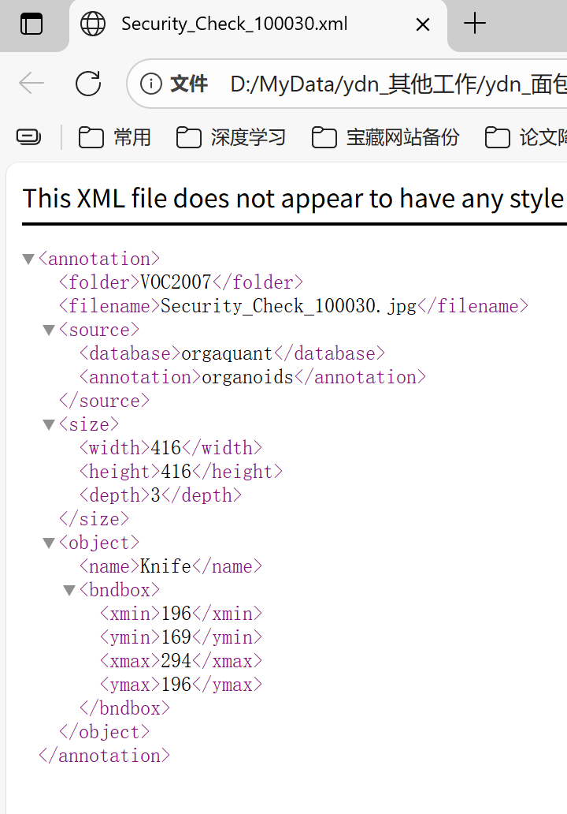
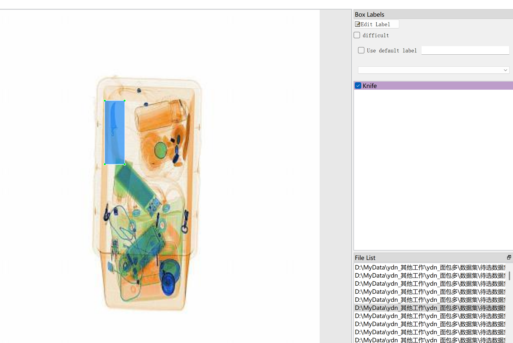

# Security Inspection X-ray Detection - Target Detection Dataset

Dataset Information Introduction: A total of 8830 images and corresponding annotation files are available. The annotation files are provided in two formats, including VOC-XML files and YOLO-TXT files.

The target objects to be detected include the following five types:
- Gun
- Knife
- Pliers
- Scissors
- Wrench

The number of bounding box information is as follows: (Annotations are generally marked in English, the Chinese names inside the brackets are provided for reference)
Note: An image may contain multiple targets, so the total number of bounding boxes may exceed the number of images.

The complete dataset includes three folders and one txt file:
all_images file: Stores the dataset's images, screenshots included:
all_txt folder and classes.txt: Stores the YOLO-TXT annotation files, in the same quantity as the images, each annotation file corresponds to an image
classes.txt:
all_xml file: VOC-XML annotation file.
In the same quantity as the images, each annotation file corresponds to an image
How to see detailed standards of the VOC-XML format can be found by searching on your own.
Both formats of annotations are usable, choose one of them accordingly.
Annotation Screenshots:

## Images

Here is a pay link on Stripe ( https://buy.stripe.com/3cs8yP7sY87d0vu9AB ). Please contact me lonlonago@foxmail.com after funding $89, and I will send you a complete data files , thank you!

